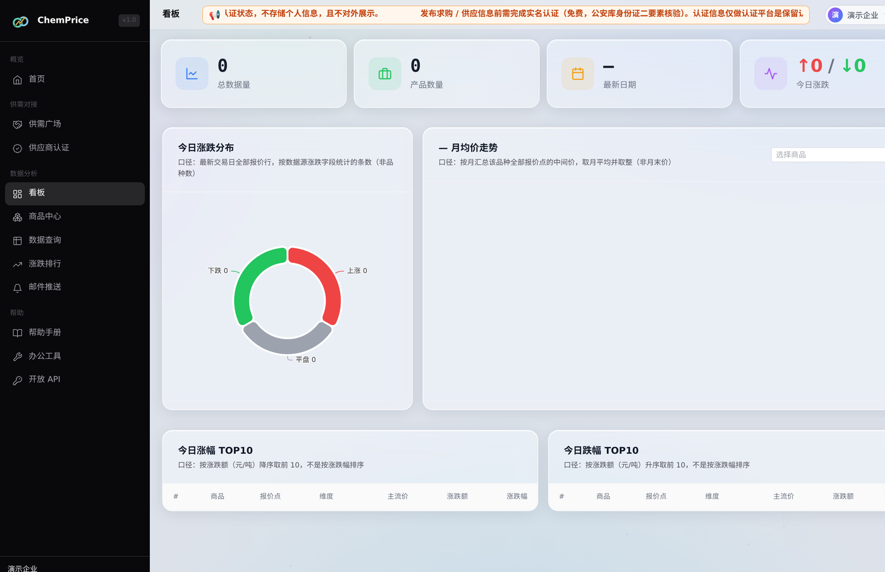
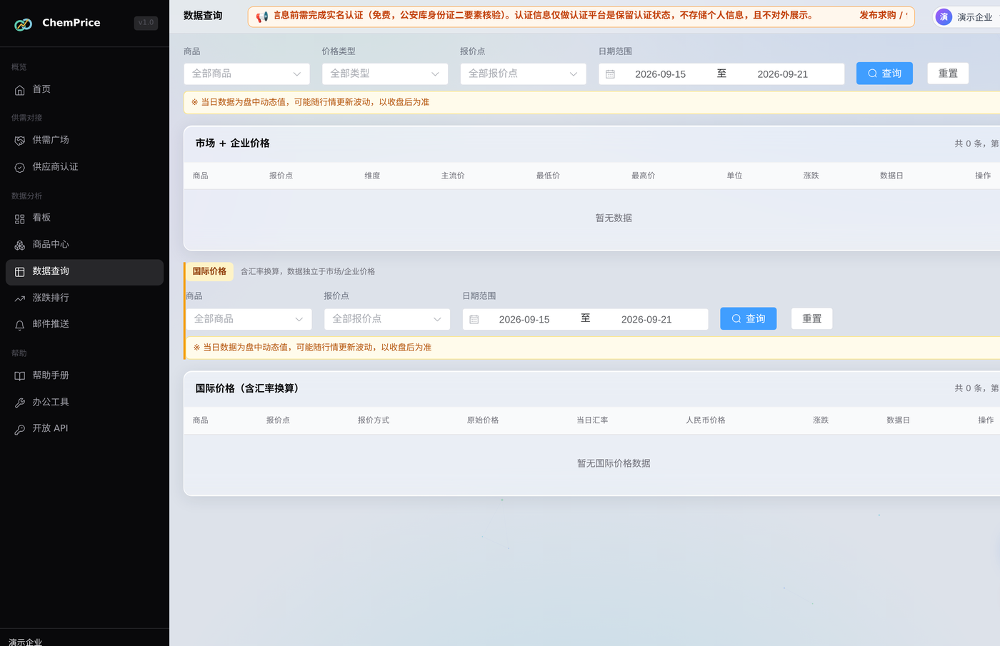
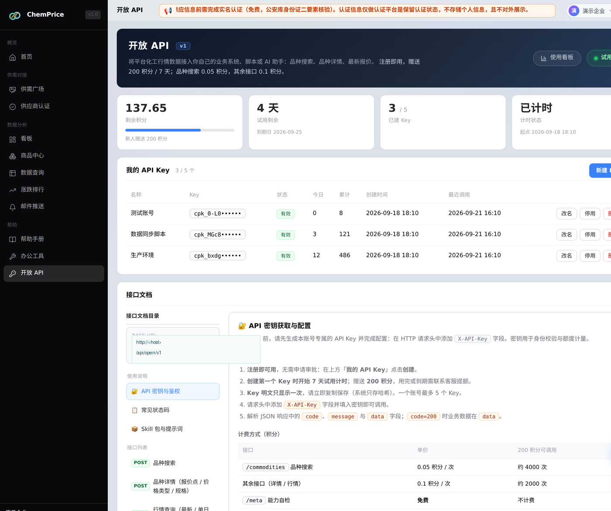
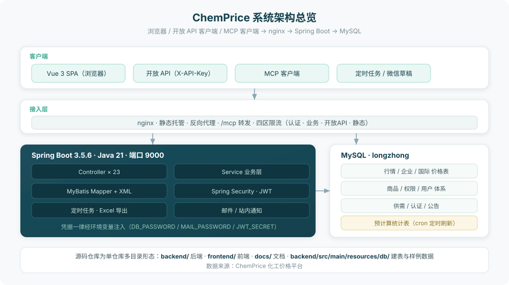
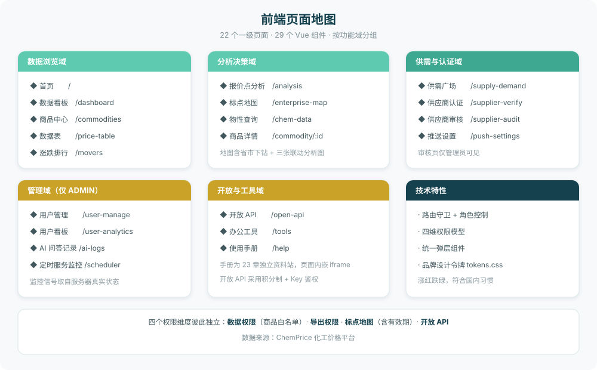
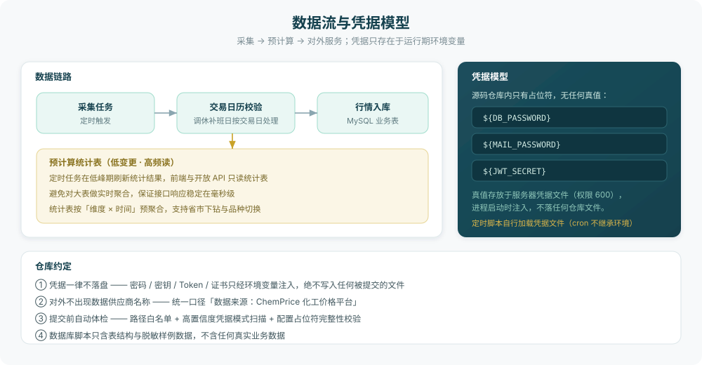
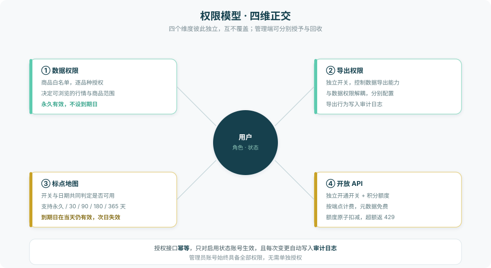

<div align="center">

# ChemPrice 化工价格平台

**面向化工行业的行情数据服务平台**
覆盖行情浏览、涨跌分析、标点地图、物性查询、供需对接与开放 API

数据来源：ChemPrice 化工价格平台


</div>

---

> ### ⚠️ 禁止商业使用
>
> 本项目采用 **PolyForm Noncommercial License 1.0.0**，**仅供学习、研究与个人非商业用途**。
> 未经书面授权**禁止任何商业使用**（出售、SaaS 化、企业内部商业运营、产品集成、数据转售等）。
>
> **商业授权与合作联系：`chemprice@163.com`**

---

## 一、项目简介

ChemPrice 是一个面向化工行业的价格数据服务平台。系统把分散的行情数据归集为可检索、可对比、可分析的数据资产，向上提供 Web 应用、开放 API 与 MCP 三类访问入口。

平台的核心能力围绕「**看数据 → 做分析 → 找企业 → 查物性 → 接系统**」这条主线展开：

| 能力 | 说明 |
|---|---|
| **行情浏览** | 多类型价格表统一检索，支持品种、地区、企业、日期区间组合筛选与导出 |
| **涨跌分析** | 涨跌排行、走势趋势、报价点集中度分析，图表与表格同源口径 |
| **标点地图** | 基于报价点注册地的省市下钻地图，配合 TOP10、帕累托、气泡矩阵三张联动分析图 |
| **物性查询** | 化工品种的理化性质、安全信息与外部权威数据源跳转 |
| **供需对接** | 供方发布供应、需方发布求购，认证企业可开启新求购邮件提醒 |
| **开放 API** | 积分制 API 开放平台，支持按端点订阅、配额管控与调用统计 |
| **AI 助手** | 站内化工问答助手，问答记录纳入审计范围 |

> 本项目为**源码仓库**，不包含生产数据与任何凭据；数据库目录仅提供建表语句与**全虚构的脱敏样例数据**。

---

## 二、数据服务

> 本章介绍平台**提供的行情数据**及其获取方式。如需商业使用，请见 [第 15 章 许可证与商业授权](#十五许可证与商业授权)。

### 2.1 数据规模

| 指标 | 规模 |
|---|---|
| **价格记录总量** | **1444 万条**（市场价 625 万 + 企业价 746 万 + 国际价 72 万） |
| **覆盖品种** | **324 个**有行情数据的化工品种 |
| **企业报价点** | **2288 个**，覆盖 **30 个省级行政区**，可下钻至地市 |
| **数据区间** | **2005 年至今**，逐交易日更新 |
| **价格口径** | 三种独立口径：市场价、企业价、国际价（含汇率换算） |
| **数据库表** | 43 张业务表 |

### 2.2 数据维度

每条价格记录包含以下维度，可按需组合筛选：

| 维度 | 说明 |
|---|---|
| 品种 | 化工品种名称、分类、计量单位 |
| 报价点 | 具体市场 / 企业，带注册地（省 / 市）信息 |
| 价格类型 | 如送到现汇、出厂自提等 |
| 业务类型 | 市场价格 / 企业价格 / 国际价格 |
| 规格 | 产品规格与含量 |
| 价格数值 | 最低价 / 主流中间价 / 最高价 |
| 涨跌 | 与相邻交易日同一报价的中间价差与涨跌幅 |
| 日期 | 交易日（周末与法定节假日休市，调休补班日正常交易） |

### 2.3 三种获取方式

| 方式 | 说明 | 费用 |
|---|---|---|
| **网页查询** | 登录平台直接浏览、筛选、导出 | 注册即用 |
| **开放 API** | 接入自有系统 / 脚本 / AI 助手，支持品种搜索、品种详情、最新报价 | 注册赠送 **200 积分**，自创建第一个 Key 起 **7 天试用**（品种搜索 0.05 积分/次，其余接口 0.1 积分/次，元数据接口免费） |
| **数据订阅 / 商业授权** | 数据批量授权、API 商用额度、私有化部署、定制开发 | 按需报价，联系 **chemprice@163.com** |

### 2.4 开放 API 快速上手

**第一步 · 获取 API Key**

1. 在平台注册账号（邮箱验证码验证）
2. 登录后进入左侧菜单 **「开放 API」** 页面
3. 点击 **「创建 API Key」** 按钮
4. ⚠️ **Key 明文只显示一次，请立即复制保存**（形如 `cpk_xxxxxxxxxxxx`）
5. 试用计时从**创建第一个 Key** 起算，共 7 天

**第二步 · 配置环境变量**（凭据不落盘的推荐做法）

```bash
export CHEMPRICE_API_KEY=cpk_你的Key
```

Windows PowerShell：
```powershell
$env:CHEMPRICE_API_KEY="cpk_你的Key"
```

**第三步 · 验证连通**

```bash
curl -s -X POST "http://<API_BASE>/meta" \
  -H "X-API-Key: $CHEMPRICE_API_KEY" \
  -H "Content-Type: application/json" \
  -d '{}'
```

**第四步 · 查询行情**（推荐流程：搜品种 → 查维度 → 查行情）

```python
import os, json, urllib.request

KEY  = os.environ["CHEMPRICE_API_KEY"]      # 从环境变量读取，不要硬编码
BASE = "http://<API_BASE>"                  # API 基址（部署后按实际地址填写）

def post(path, body=None):
    """发送 POST JSON，自动解包 {code,message,data}"""
    req = urllib.request.Request(
        BASE + path,
        data=json.dumps(body or {}).encode(),
        headers={"X-API-Key": KEY, "Content-Type": "application/json"},
    )
    j = json.loads(urllib.request.urlopen(req, timeout=30).read())
    if j.get("code") != 200:
        raise RuntimeError(j.get("message"))
    return j["data"]

# ① 搜索品种，拿到 varietiesId
vid = post("/commodities", {"q": "品种名", "limit": 5})[0]["varietiesId"]

# ② 查品种详情：有哪些报价点、价格类型、规格
detail = post("/commodities/detail", {"varietiesId": vid})
print(detail["businessTypes"], detail["priceTypes"], len(detail["markets"]))

# ③ 查最新交易日报价
latest = post("/prices/latest", {"varietiesId": vid, "limit": 10})
```

### 2.5 接口清单

| 端点 | 说明 | 计费 |
|---|---|---|
| `POST /commodities` | 品种搜索（模糊匹配），返回 `varietiesId` | 0.05 积分 |
| `POST /commodities/detail` | 品种详情：业务类型 / 价格类型 / 规格 / 报价点列表 | 0.1 积分 |
| `POST /prices/latest` | 单日行情查询，支持按业务类型 / 价格类型 / 报价点过滤 | 0.1 积分 |
| `POST /meta` | 能力自描述，可用于连通性测试 | 免费 |

**说明**：行情查询为**单日语义** —— 不传 `date` 取最新交易日，需要多天数据请按日循环调用。
日期范围 **2005-01-01 至今**。

### 2.6 数据采购与商务合作

需要批量数据、高并发额度、私有化部署或定制开发，请联系：

| 联系方式 | |
|---|---|
| **商务邮箱** | **chemprice@163.com** |
| **公众号** | 扫码关注「ChemPrice 化工价格平台」，后台留言 |

---

## 三、界面预览

### 数据看板



首页看板汇总当日行情概览：总数据量、产品数量、最新日期与今日涨跌统计，下接涨跌分布环图、月均价走势以及涨跌 TOP10 榜单。左侧为完整的功能导航分组。

### 数据查询



行情检索支持按商品、价格类型、报价点与日期区间组合筛选。市场与企业价格、国际价格分属两套独立口径——国际价格含汇率换算，不参与国内价格计算。

### 开放 API



开放 API 采用积分制：注册即赠送初始积分与试用期，每个账号可创建多个 Key，Key 明文仅展示一次。页面同时内置完整接口文档与计费说明。

---

## 四、系统架构



系统自上而下分为四层：

- **客户端层** —— Web 单页应用、开放 API 调用方、MCP 客户端，以及运行在服务器上的定时任务。
- **接入层** —— nginx 承担静态资源托管、后端反向代理、`/mcp` 路径转发与四区限流（认证 / 业务 / 开放 API / 静态资源各自独立配额）。
- **应用层** —— Spring Boot 单体应用，23 个 Controller 按业务域拆分，业务逻辑集中在 Service 层，数据访问由 MyBatis Mapper 与 XML 承担。
- **数据层** —— MySQL 承载行情、商品、权限、供需等业务表；另有一组**预计算统计表**，由定时任务在低峰期刷新，供高频读取使用。

---

## 五、前端页面地图



前端共 22 个一级页面、29 个 Vue 组件，按功能域组织。路由守卫负责登录态校验与角色控制，管理员专属页面在路由元信息中标记，非管理员访问时重定向回首页。

---

## 六、数据流与凭据模型



### 数据链路

采集任务在**交易日历校验**通过后拉取行情入库。低变更、高频读的统计类数据不在请求时实时聚合，而是由定时任务预计算写入统计表——这是本系统保证接口响应稳定的核心设计。

### 凭据模型（重要）

**仓库内不存在任何凭据真值。** 所有敏感配置在源码中是环境变量占位符：

| 变量 | 用途 |
|---|---|
| `DB_PASSWORD` | MySQL 连接密码 |
| `MAIL_PASSWORD` | SMTP 邮件发送密码 |
| `JWT_SECRET` | JWT 签名密钥 |

真值仅存放于服务器上的凭据文件（权限 `600`），进程启动时注入。**定时脚本会自行加载凭据文件**——因为 cron 不继承登录会话的环境变量，这一点是运维时的常见陷阱。

---

## 七、权限模型



平台采用**四维正交**权限设计，四个维度彼此独立、互不覆盖：

1. **数据权限** —— 商品白名单，决定用户可浏览的行情范围。**永久有效，不设到期日。**
2. **导出权限** —— 独立开关，控制数据导出能力，导出行为写入审计日志。
3. **标点地图** —— 开关与有效期共同判定。支持永久 / 30 / 90 / 180 / 365 天及自定义时长；**到期日在当天仍然有效**，次日失效。管理员账号始终具备该权限。
4. **开放 API** —— 独立开通开关，配合积分额度管理。按端点计费，元数据接口免费。

授权接口**幂等**，仅对启用状态的账号生效，且每次变更都会自动写入审计日志。

---

## 八、技术栈

### 后端

| 项目 | 版本 / 说明 |
|---|---|
| 框架 | Spring Boot 3.5.6 |
| 运行时 | Java 21 |
| 安全 | Spring Security + JJWT（无状态 JWT 鉴权） |
| 数据访问 | MyBatis + Mapper XML |
| 数据库 | MySQL 8.0 |
| 报表导出 | EasyExcel |
| 其他 | Lombok、Spring Validation、Spring Mail |

### 前端

| 项目 | 版本 / 说明 |
|---|---|
| 框架 | Vue 3.4（组合式 API） |
| 构建 | Vite 6.2 |
| 状态管理 | Pinia 2.1 |
| 路由 | Vue Router 4.3 |
| UI 组件 | Element Plus 2.6 |
| 可视化 | ECharts 5.5 |
| 动效 | GSAP 3.12 |
| 图标 | lucide-vue-next |
| 网络 | axios 1.6 |

### 设计约定

- **涨跌配色遵循国内习惯**：涨为红、跌为绿。
- 品牌色板与组件密度统一由 `docs/tokens.css` 定义，前端引用同一套设计令牌。
- 弹层统一使用自研 `AppModal` 组件，避免第三方弹层的层级与可点击性陷阱。

---

## 九、目录结构

```
.
├── backend/                          Spring Boot 后端（端口 9000）
│   ├── pom.xml
│   ├── mvnw / mvnw.cmd               Maven Wrapper
│   └── src/main/
│       ├── java/com/datamarket/
│       │   ├── controller/           23 个 Controller，按业务域拆分
│       │   ├── service/              业务逻辑层
│       │   ├── mapper/               MyBatis Mapper 接口
│       │   ├── entity/               实体
│       │   ├── dto/                  传输对象
│       │   ├── config/               配置类（CORS、限流、过滤器注册等）
│       │   ├── security/             鉴权与 JWT
│       │   ├── common/               统一响应体与通用组件
│       │   └── util/                 工具类
│       └── resources/
│           ├── application.yml       配置（凭据使用环境变量占位符）
│           ├── mapper/               MyBatis XML
│           └── db/
│               ├── schema.sql        43 张表的建表语句
│               ├── sample_data.sql   脱敏样例数据（全虚构）
│               └── README.md         数据库脚本说明
│
├── frontend/                         Vue 3 前端
│   ├── package.json
│   ├── vite.config.js
│   ├── public/                       静态资源
│   └── src/
│       ├── api/                      接口封装（统一 axios 实例）
│       ├── views/                    页面组件
│       ├── layouts/                  布局
│       ├── components/               通用组件
│       ├── composables/              组合式函数
│       ├── stores/                   Pinia 状态
│       ├── router/                   路由与守卫
│       ├── utils/                    工具
│       └── style.css                 全局样式
│
├── docs/                             开发文档
│   ├── images/                       README 配图（架构示意图 + 界面截图）
│   ├── 小程序需求文档.md
│   ├── 小程序AI开发提示词.md
│   ├── 接口清单.md / .json
│   ├── tokens.css                    设计令牌
│   └── db-tunnel/                    数据库隧道方案（不开放公网端口）
│
├── README.md                         本文件
├── README-deploy.md                  部署与运维说明
└── LICENSE
```

---

## 十、本地运行

### 前置要求

- JDK 21
- Node.js 18+
- MySQL 8.0

### 1. 初始化数据库

```bash
mysql -u root -p -e "CREATE DATABASE longzhong DEFAULT CHARACTER SET utf8mb4;"
mysql -u root -p longzhong < backend/src/main/resources/db/schema.sql
mysql -u root -p longzhong < backend/src/main/resources/db/sample_data.sql   # 可选：样例数据
```

> `sample_data.sql` 中的品种、地区、企业名称均为虚构占位符，仅用于验证功能是否跑通。

### 2. 配置环境变量

```bash
export DB_PASSWORD='你的数据库密码'
export MAIL_PASSWORD='你的邮箱授权码'
export JWT_SECRET='长度不少于 32 字符的随机字符串'
```

### 3. 启动后端

```bash
cd backend
./mvnw package -DskipTests
java -jar target/data-market-0.0.1-SNAPSHOT.jar --server.port=9000
```

### 4. 启动前端

```bash
cd frontend
npm install
npm run dev          # 开发模式
# 或
npm run build        # 生产构建，产物在 dist/
```

---

## 十一、数据库

`backend/src/main/resources/db/` 提供三份文件：

| 文件 | 内容 |
|---|---|
| `schema.sql` | 43 张表的建表语句（已清理自增起始值与历史遗留注释） |
| `sample_data.sql` | 三张价格表各 200 行、共 600 行**全虚构**样例数据 |
| `README.md` | 导入方式与脱敏声明 |

**关于数据安全的说明：**

- 仓库中的样例数据由脚本按固定随机种子生成，**不含任何真实业务数据**。
- 样例数据仅从真实库读取结构骨架（计量单位、规格、价格类型、业务类型等**枚举值**），品种名、地区名、企业名、价格数值全部为虚构。
- 表结构中的字段注释已统一改写，不出现任何数据供应商名称。

---

## 十二、部署

生产部署细节见 **[README-deploy.md](README-deploy.md)**，涵盖：

- 服务器目录布局与部署位置说明
- 后端 jar 构建与重启流程
- 前端构建产物同步至 nginx 静态目录
- 定时任务与交易日历调度说明
- 日志位置与常见问题排查

---

## 十三、开发文档

`docs/` 目录提供完整的设计与接口资料，其中：

- **接口清单** —— 全部接口的路径、方法、鉴权要求与参数说明。
- **设计令牌** —— 品牌色板、涨跌配色、组件密度约定。
- **需求文档与 AI 开发提示词** —— 功能范围、合规前置约束与技术方案。

文档站点：`http://<服务器地址>/docs/`

---

## 十四、仓库约定

开发本仓库时请遵守以下约定：

1. **⛔ 凭据一律不落盘。** 密码、密钥、Token、证书只通过环境变量注入，绝不写入任何会被提交的文件。提交前检查 `application.yml` 等配置，确保只含占位符。

2. **⛔ 对外不出现数据供应商名称。** 所有面向用户的文案（页面、文档、邮件、公告）统一使用「数据来源：ChemPrice 化工价格平台」。

3. **提交前做凭据体检。** 检查待提交文件路径是否符合白名单，并扫描高置信度凭据模式，确认配置文件中占位符完整。

4. **数据库脚本只含结构与脱敏样例。** 不得将生产数据导出到仓库。

5. **新增或修改功能时同步更新文档。** 用户可感知的行为变更（限流、配额、权限、下线）优先级等同新功能。

---

## 十五、许可证与商业授权

本项目采用 **[PolyForm Noncommercial License 1.0.0](LICENSE)**，并附加中文声明。

### 免费允许（非商业）

- 个人学习、技术研究与本地实验
- 学校、科研机构、公益组织、政府机构的教学与科研使用
- 技术社区、博客、论文中的引用与分享（需注明出处）
- 非商业目的的二次开发（须保留本许可协议）

### ⛔ 禁止（未经书面授权）

- **直接售卖** —— 作为商品出售、出租或许可给第三方
- **SaaS / 云服务化** —— 部署为对外收费的在线服务或数据订阅服务
- **企业内部商业运营** —— 以营利为目的的公司内部使用
- **产品集成** —— 嵌入商业软件产品或解决方案中分发
- **数据转售** —— 利用本项目获取数据后对外售卖

### 关于数据

本协议**仅授权代码**。平台展示与 API 提供的**行情数据及其衍生数据不在授权范围内**，
其权利归数据提供方所有。任何形式的数据使用、分发、再发布均须另行获得书面授权。

### 商业授权与合作

| 联系方式 | |
| --- | --- |
| **邮箱** | **chemprice@163.com** |
| **公众号** | 扫码关注「ChemPrice 化工价格平台」，后台留言 |

可授权范围：源码商用许可、数据授权、API 商用额度、定制开发、私有化部署。
具体条款以双方签署的书面协议为准。

---

## 十六、联系方式

<div align="center">

**商务合作 / 数据订阅 / 技术交流**

📧 **chemprice@163.com**


扫码关注公众号「**ChemPrice 化工价格平台**」

行业行情动态 · 数据订阅咨询 · 商务合作洽谈

</div>

---

<div align="center">

**数据来源：ChemPrice 化工价格平台**

© ChemPrice 化工价格平台 · 禁止商业使用 · 商业授权请联系 chemprice@163.com

</div>
